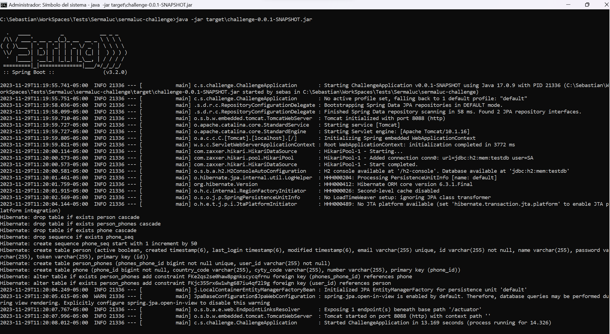
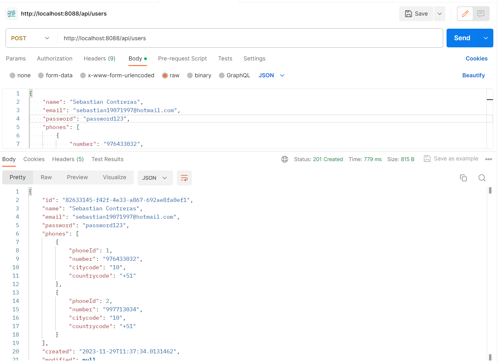
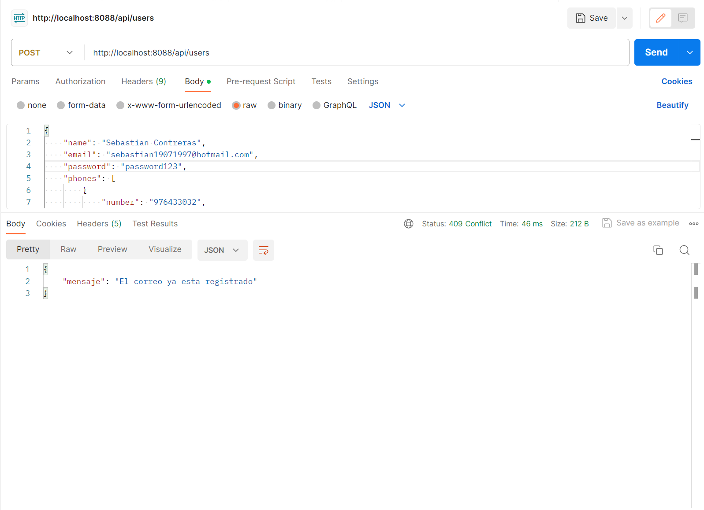
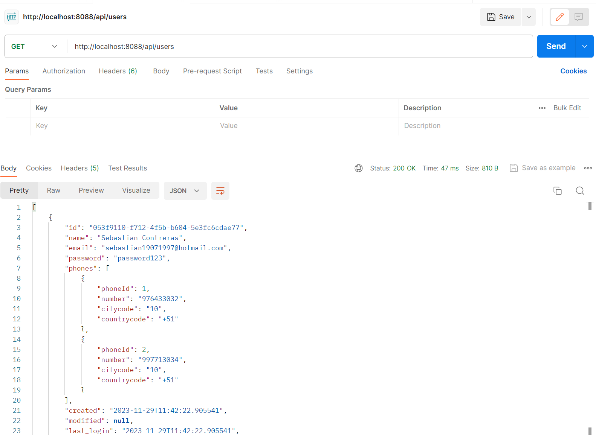
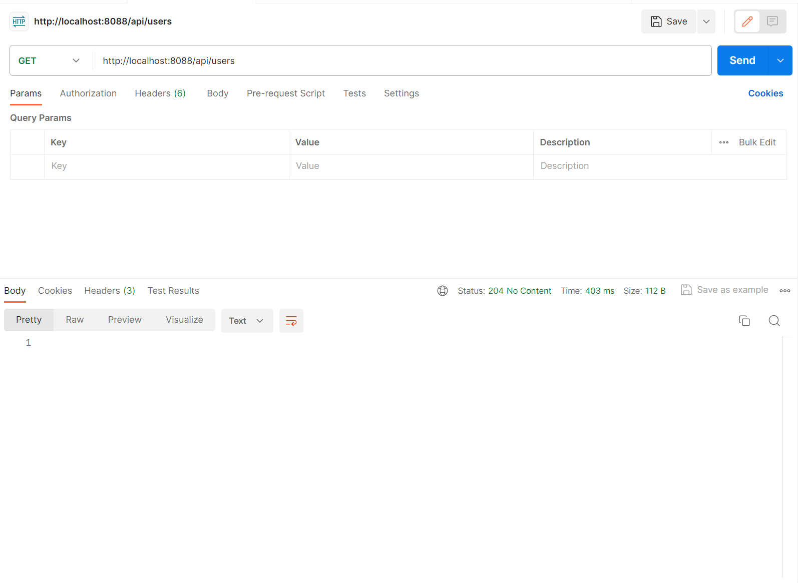
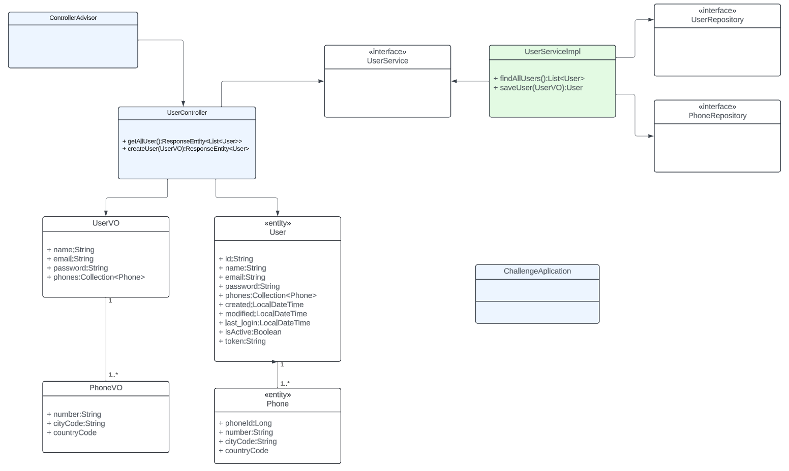
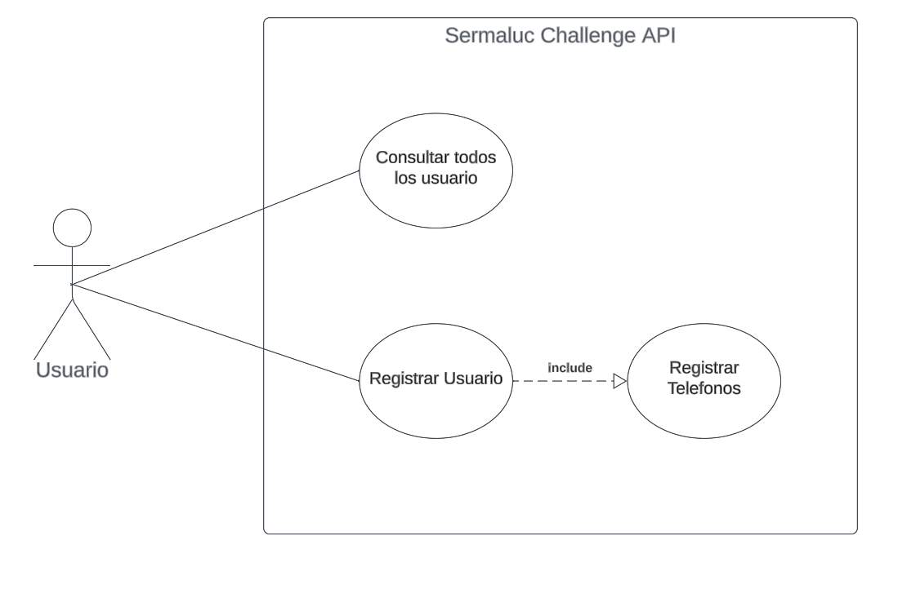
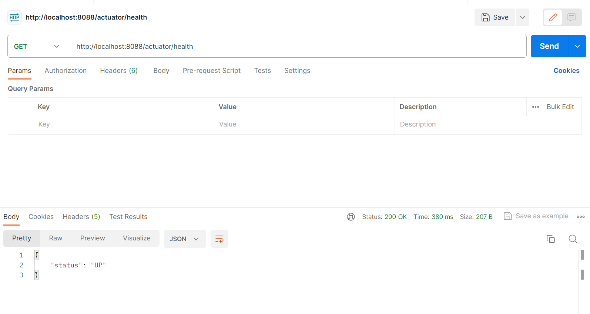
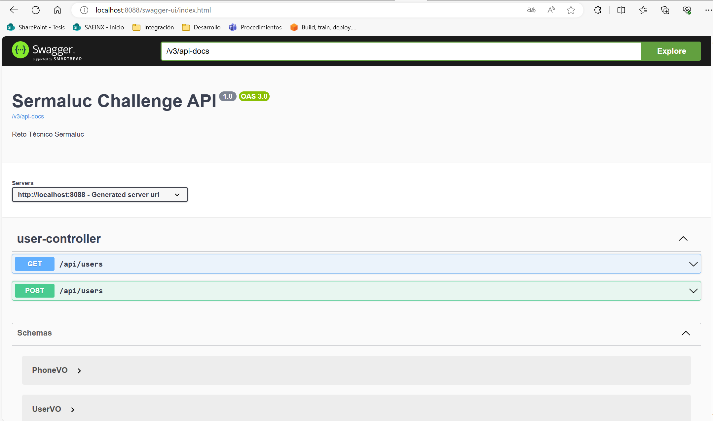

# sermaluc-challenge
Technical Challenge for Sermaluc

* El proyecto ha sido desarrollado con los siguientes frameworks
    - SpringBoot 3.2.0
    - Spring Data JPA
    - H2 Database
    - Spring Boot Actuator
    - Apache Common Validators
    - Java JWT
    - Lombok
    - SpringDOC OpenAPI
    - JUnit 5

---

# Pasos para correr la aplicacion

Clonar el repositorio:

    $ git clone https://github.com/sebastian1907/sermaluc-challenge


* Eejcutar para probar la aplicacion:
```bash
mvn test
```

* Es posible asignar valores al properties del entorno en tu archivo `application.properties`.

```bash
app.security.jwt.secretKey=${APP_SECURITY_JWT_SECRET_KEY}
app.security.jwt.expirationTime=${APP_SECURITY_JWT_EXPIRATION_TIME} 
```

* Ejecutar para hacer build a la aplicacion:
```bash
mvn clean package install
```

- Donde:
    * __APP_SECURITY_JWT_SECRET_KEY__ -> secret key
    * __APP_SECURITY_JWT_EXPIRATION_TIME__ -> expiration time en segundos

* Y por ultimo correr la aplicacion de la siguiente manera.

```bash
APP_SECURITY_JWT_SECRET_KEY=secretKey
APP_SECURITY_JWT_EXPIRATION_TIME=800

java -jar target\challenge-0.0.1-SNAPSHOT.jar
```



---

# Pruebas

### Crear Usuario:

    ```bash
    curl --location 'http://localhost:8088/api/users' \
    --header 'Content-Type: application/json' \
    --data-raw '{
        "name": "Sebastian Contreras",
        "email": "sebastian19071997@hotmail.com",
        "password": "password123",
        "phones": [
            {
                "number": "976433032",
                "citycode": "10",
                "countrycode": "+51"
            },
            {
                "number": "997713034",
                "citycode": "10",
                "countrycode": "+51"
            }
        ]
    }'
    ```


* Creacion de usuario exitosa



* Conflicto de correo




### Listar Usuarios:

    ```bash
    curl --location 'http://localhost:8088/api/users'
    ```

* Listar usuarios 



* No Content



---

## Diagrma de Clases



## Diagrama de Casos de uso



---
## Check health app 
```bash
http://localhost:8088/actuator/health
```


---
## Swagger APIs Specification
```bash
http://localhost:8088/swagger-ui/index.html
```

